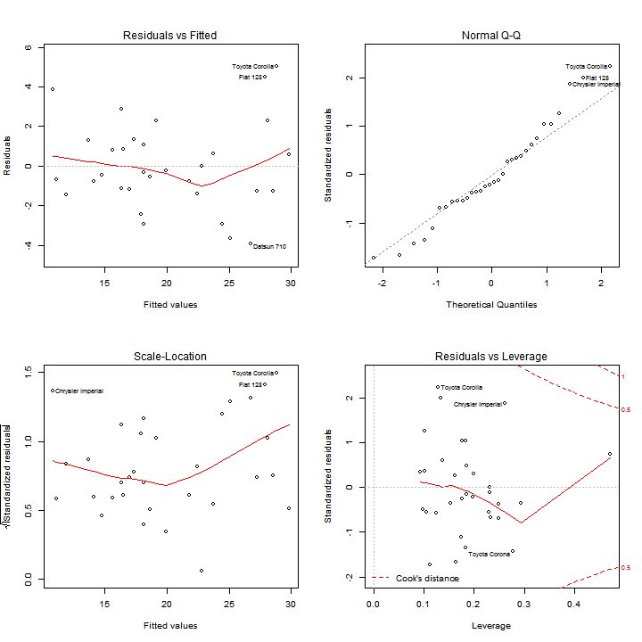
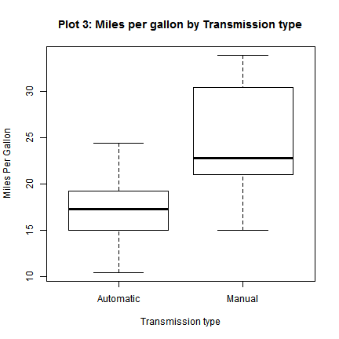

#### Coursera : Regression Models - Course Project

## Exploring Motor Trend Car Road Tests 

### Executive Summary

In this project, we work for Motor Trend (a magazine about the automobile industry) and we will analyze the <code>mtcars</code> data set. Looking at a data set of a collection of cars (which contains 32 observations), they are interested in exploring the relationship between a set of variables and miles per gallon <code>mpg</code> (outcome). They are particularly interested in the following two questions:

- Is an automatic or manual transmission better for <code>mpg</code>?
- Quantifying how different is the <code>mpg</code> between 'Automatic' and 'Manual' transmissions?

### Data Preprocessing and Transformations

First of all, we load the data set, perform the necessary data transformations by factoring the some variables and look the data:


```r
data(mtcars)
mtcars$cyl <- factor(mtcars$cyl)
mtcars$vs <- factor(mtcars$vs)
mtcars$gear <- factor(mtcars$gear)
mtcars$carb <- factor(mtcars$carb)
mtcars$am <- factor(mtcars$am, labels = c("Automatic", "Manual"))
str(mtcars)
```

```
## 'data.frame':	32 obs. of  11 variables:
##  $ mpg : num  21 21 22.8 21.4 18.7 18.1 14.3 24.4 22.8 19.2 ...
##  $ cyl : Factor w/ 3 levels "4","6","8": 2 2 1 2 3 2 3 1 1 2 ...
##  $ disp: num  160 160 108 258 360 ...
##  $ hp  : num  110 110 93 110 175 105 245 62 95 123 ...
##  $ drat: num  3.9 3.9 3.85 3.08 3.15 2.76 3.21 3.69 3.92 3.92 ...
##  $ wt  : num  2.62 2.88 2.32 3.21 3.44 ...
##  $ qsec: num  16.5 17 18.6 19.4 17 ...
##  $ vs  : Factor w/ 2 levels "0","1": 1 1 2 2 1 2 1 2 2 2 ...
##  $ am  : Factor w/ 2 levels "Automatic","Manual": 2 2 2 1 1 1 1 1 1 1 ...
##  $ gear: Factor w/ 3 levels "3","4","5": 2 2 2 1 1 1 1 2 2 2 ...
##  $ carb: Factor w/ 6 levels "1","2","3","4",..: 4 4 1 1 2 1 4 2 2 4 ...
```


### Exploratory Analysis

We explored various relationships between variables of interest and the outcome. Initially, we plot the relationships between all the variables of the dataset (see plot 2 in the Appendix). From the plot 1 we notice that variables like <code>cyl</code>, <code>disp</code>, <code>hp</code>, <code>drat</code>, <code>wt</code>, <code>vs</code> and <code>am</code> seem to have some strong correlation with <code>mpg</code>. We will use linear models to quantify that in the next section. 

Additionally we plot a boxplot of the variable <code>mpg</code> when <code>am</code> is 'Automatic' or 'Manual' (see plot 3 in the Appendix). This plot shows that the <code>mpg</code> incresases when the transmission is 'Manual'.

### Regression Analysis

In this section we will build linear regression models based on the different variables of interest and try to find out the best model fit. We will compare it with the base model which we have using <b>ANOVA</b>. After model selection, we will perform an analysis of residuals.

### Build the Model

Based on plot 2 there are several variables seem to have high correlation with <code>mpg</code>. We willl build an initial model with all the variables as predictors and perfom stepwise model selection to select significant predictors for the final model. This is taken by the <b>step</b> method, which runs <code>lm</code> multiple times to build multiple regression models and select the best variables from them, using both <b>forward selection</b> and <b>backward elimination</b> methods by the <b>AIC</b> algorithm:


```r
mod_init <- lm(mpg ~ ., data = mtcars)
mod_best <- step(mod_init, direction = "both")
```


As we can see, the best model obtained from the above computations have <code>cyl</code>, <code>wt</code>, <code>hp</code> and <code>am</code> as relevant variables:


```r
summary(mod_best)
```

```
## 
## Call:
## lm(formula = mpg ~ cyl + hp + wt + am, data = mtcars)
## 
## Residuals:
##    Min     1Q Median     3Q    Max 
## -3.939 -1.256 -0.401  1.125  5.051 
## 
## Coefficients:
##             Estimate Std. Error t value Pr(>|t|)    
## (Intercept)  33.7083     2.6049   12.94  7.7e-13 ***
## cyl6         -3.0313     1.4073   -2.15   0.0407 *  
## cyl8         -2.1637     2.2843   -0.95   0.3523    
## hp           -0.0321     0.0137   -2.35   0.0269 *  
## wt           -2.4968     0.8856   -2.82   0.0091 ** 
## amManual      1.8092     1.3963    1.30   0.2065    
## ---
## Signif. codes:  0 '***' 0.001 '**' 0.01 '*' 0.05 '.' 0.1 ' ' 1
## 
## Residual standard error: 2.41 on 26 degrees of freedom
## Multiple R-squared:  0.866,	Adjusted R-squared:  0.84 
## F-statistic: 33.6 on 5 and 26 DF,  p-value: 1.51e-10
```

We can see that the adjusted R<sup>2</sup> value is equal to 0.84 which is the maximum obtained considering all combinations of variables. Therefore we can conclude that more than 84% of the variability is explained by this model.

Now, using ANOVA, we will compare the base model with only <code>am</code> as the predictor variable and the best model obtained above:


```r
mod_base <- lm(mpg ~ am, data = mtcars)
anova(mod_best, mod_base)
```

```
## Analysis of Variance Table
## 
## Model 1: mpg ~ cyl + hp + wt + am
## Model 2: mpg ~ am
##   Res.Df RSS Df Sum of Sq    F  Pr(>F)    
## 1     26 151                              
## 2     30 721 -4      -570 24.5 1.7e-08 ***
## ---
## Signif. codes:  0 '***' 0.001 '**' 0.01 '*' 0.05 '.' 0.1 ' ' 1
```

Looking at this result, the p-value obtained is highly significant, and we reject the null hypothesis that the confounder variables <code>cyl</code>, <code>hp</code> and <code>wt</code> do not contribute to the accuracy of the model.

### Analysis of the Residuals and Diagnostics

Now we explore the residual plots of our regression model and also compute some of the regression diagnostics for our model to find out some interesting leverage points (often called as outliers) in the data set:


```r
par(mfrow = c(2, 2))
plot(mod_best, which = 1)
plot(mod_best, which = 2)
plot(mod_best, which = 3)
plot(mod_best, which = 5)
```

 


From these plots we can conclude the following:

- The Residuals vs Fitted plot shows random points on the plot that verifies the independence condition.
- In the Normal Q-Q plot the points mostly fall on the line indicating that the residuals are normally distributed.
- In the Scale-Location plot the points are in a constant band pattern, indicating constant variance.
- Finally, the Residuals vs Leverage plot shows some points of interest (outliers or leverage points) are in the top right corner.

Now we will compute some regression diagnostics of our model to find out these interesting leverage points. We compute top three points in each case of influence measures.


```r
lev <- hatvalues(mod_best)
tail(sort(lev), 3)
```

```
##       Toyota Corona Lincoln Continental       Maserati Bora 
##              0.2778              0.2937              0.4714
```

```r
inf <- dfbetas(mod_best)
tail(sort(inf[, 6]), 3)
```

```
## Chrysler Imperial          Fiat 128     Toyota Corona 
##            0.3507            0.4292            0.7305
```

Looking at this result we see that they the same cars shown in the residual plots.

###  Statistical Inference

Finally, we will perform a t-test assuming that the transmission data has a normal distribution and we will see that the manual and automatic transmissions are significatively different:


```r
t.test(mpg ~ am, data = mtcars)
```

```
## 
## 	Welch Two Sample t-test
## 
## data:  mpg by am
## t = -3.767, df = 18.33, p-value = 0.001374
## alternative hypothesis: true difference in means is not equal to 0
## 95 percent confidence interval:
##  -11.28  -3.21
## sample estimates:
## mean in group Automatic    mean in group Manual 
##                   17.15                   24.39
```


### Conclusions

From the <code>summary(mod_best)</code> we can conclude the following:

- Miles per gallon <code>mpg</code> will increase by 1.81 in cars with 'Manual' transmission compared to cars with 'Automatic' transmission (adjusted by <code>hp</code>, <code>cyl</code>, and <code>wt</code>). So, the conclusion for Motor Trend Magazine is: 'Manual' transmission is better for <code>mpg</code>.
- Miles per gallon <code>mpg</code> will decrease by 2.5  for every 1000 lb of increase in <code>wt</code> (adjusted by <code>hp</code>, <code>cyl</code>, and <code>am</code>).
- Miles per gallon <code>mpg</code> decreases with increase of <code>hp</code>.
- Miles per gallon <code>mpg</code> will decrease by a factor of 3 and 2.2 if number of cylinders <code>cyl</code> increases from 4 to 6 and 8, respectively (adjusted by <code>hp</code>, <code>wt</code>, and <code>am</code>).

## Appendix

As we shown in Exploratoy Analysis section we explored various relationships between variables of interest and the outcome. We plot the relationships between all the variables of the dataset:


```r
library(car)
scatterplot.matrix(~mpg + cyl + disp + hp + drat + wt + qsec + vs + am + gear + 
    carb, data = mtcars, main = "Plot 2: Scatterplot Matrix")
```

 


   
Additionally we plot a boxplot of the variable <code>mpg</code> when <code>am</code> is 'Automatic' or 'Manual':


```r
boxplot(mpg ~ am, data = mtcars, main = "Plot 3: Miles per gallon by Transmission type", 
    xlab = "Transmission type", ylab = "Miles Per Gallon")
```

 


(cc) mhsilvav
